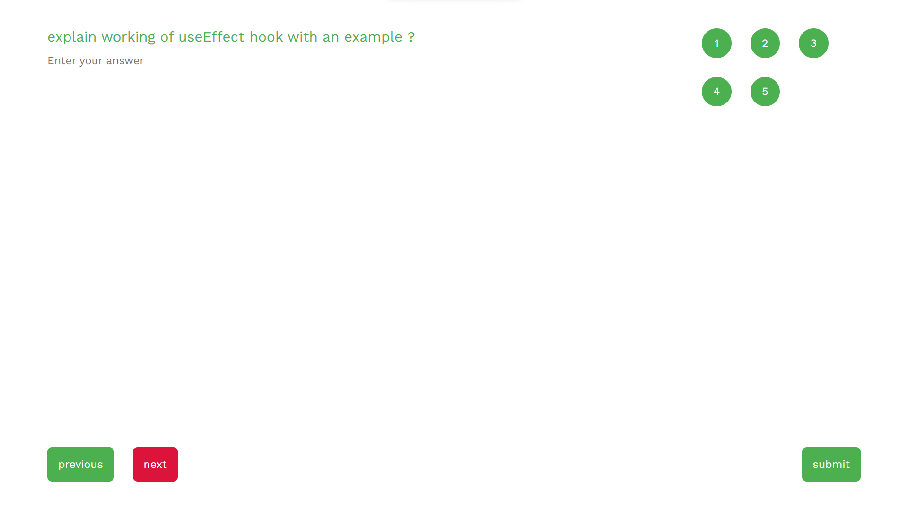
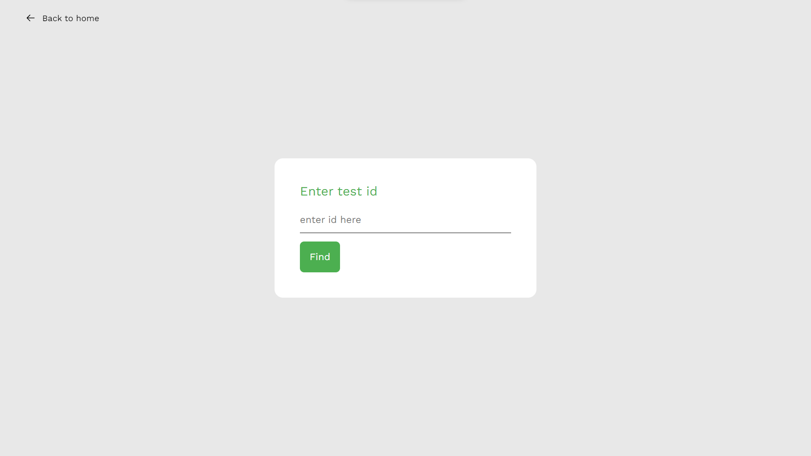

This Application is MERN stack application

### Server-Side (Express app with MongoDB)

1. **Setting up Express App:**
   - Initialize a Node.js project.
   - Install Express for creating a web server.
   - Create a main server file (e.g., `index.js`) and set up the basic Express app with a specified port.

2. **MongoDB and Mongoose Setup:**
   - Install the Mongoose library to interact with MongoDB.
   - Connect to a MongoDB database using Mongoose.
   - Define a connection to the database and handle connection events (e.g., success and error).

3. **Create Mongoose Schemas:**
   - Define data structures using Mongoose schemas.
   - create a models folder wherein we include
     1) questionSchema which includes things like username: name of the admin, topic: topic of the test, difficulty: difficulty level of test, duration: duration of test in seconds, category: category of the test, question-one, question-two, question-three, question-four and question-five
     2) answersSchema which includes answers array where storing answers of all questions into it, username: name of user.
     3) userSchema which includes username, email, password, admin: whether user is admin or not and designation.
     4) feedbackSchema which includes username, email and feedback.

4. **Create Routes:**
   - Set up Express routes to handle different operations.
   - Each route should interact with the MongoDB database using Mongoose to perform the desired operation.
   - create a routes folder wherein we include.
     1) answerRoute which has one post api request which is for storing answers of each user in the database.
     2) authenticationRoute which has two post api requets one for login and one for signup.
     3) feedbackRoute which has one post api request for sending feedback.
     4) testRoute which has one post api which is to make a test and one get api request to find the already made test.

### Client-Side (React app with Axios)

1. **Setting up React App:**
   - Create a new React app using Create React App.
   - Navigate to the project directory and organize the code into components and pages.

2. **Create Components and Pages:**
   - Create React components for different functionalities (e.g., index, test, finder, question, login, signup etc).
   - Design the user interface using JSX to represent forms, buttons, and other elements needed for the application.

3. **Axios for API Requests:**
   - Install Axios to make HTTP requests from the React app to the Express server.
   - Use Axios to perform API requests for various operations such as creating tests, fetching tests, etc.
   - Handle the responses from the server appropriately, for example, updating the UI with fetched data or showing error messages.

### Workflow Overview:

1. **Admin Side:**
   - The admin creates tests by providing a title and adding questions with options and correct answers.
   - Upon submission, the data is sent to the Express server using an API endpoint, where it is processed and stored in the MongoDB database.

2. **User Side:**
   - Users access the application and are presented with an interface to enter a test ID.
   - Upon entering a valid test ID, the React app sends a request to the server to fetch the test details using an API endpoint.
   - The server retrieves the test data from MongoDB and sends it back to the React app.

3. **Taking the Test:**
   - Users answer the questions presented in the React app.
   - The app may submit answers to the server for scoring or store them locally until the test is complete.
   - The server may provide immediate feedback or store the results for later retrieval.

### Context API for Login and Signup

1. **Authentication Context:**
   - Create a new context using `createContext()` to manage the authentication state.
   - This context will provide a state (logged in or not) and functions for login, signup, and logout.

2. **Authentication Provider Component:**
   - Create a higher-order component (e.g., `AuthProvider`) that wraps the entire application or relevant sections.
   - Inside this component, use the `useState` hook to manage the authentication state and provide the state and functions through the context provider.

3. **Login Component:**
   - Create a `Login` component that consumes the authentication context.
   - Design a login form with input fields for username and password.
   - Use the `useContext` hook to access the authentication state and functions.
   - Implement a function to handle the login process, which may involve making an API request to the server for validation.

4. **Signup Component:**
   - Similarly, create a `Signup` component that consumes the authentication context.
   - Design a signup form with input fields for username, email, and password.
   - Use the `useContext` hook to access the authentication state and functions.
   - Implement a function to handle the signup process, which typically involves creating a new user account on the server.

5. **Navigation Component:**
   - If your app has a navigation component, such as a header, include elements for login and logout.
   - Use the authentication context to conditionally render login or logout buttons based on the user's authentication state.

6. **Protected Routes:**
   - If there are routes that should only be accessible to authenticated users, create a `PrivateRoute` component.
   - This component can check the authentication state and either render the requested route or redirect the user to the login page.

7. **Logout Functionality:**
   - Include a logout function in the authentication context.
   - This function should clear any authentication tokens, update the authentication state to indicate the user is logged out, and perform any necessary cleanup.

8. **Error Handling:**
   - Implement error handling for login and signup processes.
   - Display error messages to users if authentication fails or if there are issues with the provided credentials.

### Workflow Overview:

1. **Login:**
   - Users enter their credentials in the login form.
   - The login component triggers the login function, which may involve an API request.
   - Upon successful login, update the authentication state to indicate that the user is logged in.

2. **Signup:**
   - Users enter their information in the signup form.
   - The signup component triggers the signup function, which typically involves creating a new user account on the server.
   - Upon successful signup, the user may be automatically logged in.

3. **Authentication State:**
   - The authentication state is managed globally by the `AuthProvider` component.
   - Other components can access the authentication state and functions using the authentication context.

4. **Logout:**
   - Users trigger the logout function, which updates the authentication state to indicate that the user is logged out.

### Website Snapshots

1) Signup page

2) Login Page

3) Home page

4) Find page here users enter id of test to find the test and then attend the test.

5) Test page here user can attend the test and give answers and all.

